# Mermaid Syntax Reference

Comprehensive syntax guide for creating Mermaid diagrams.

## Flowchart

System architecture, processes, and decision trees.

### Basic Syntax

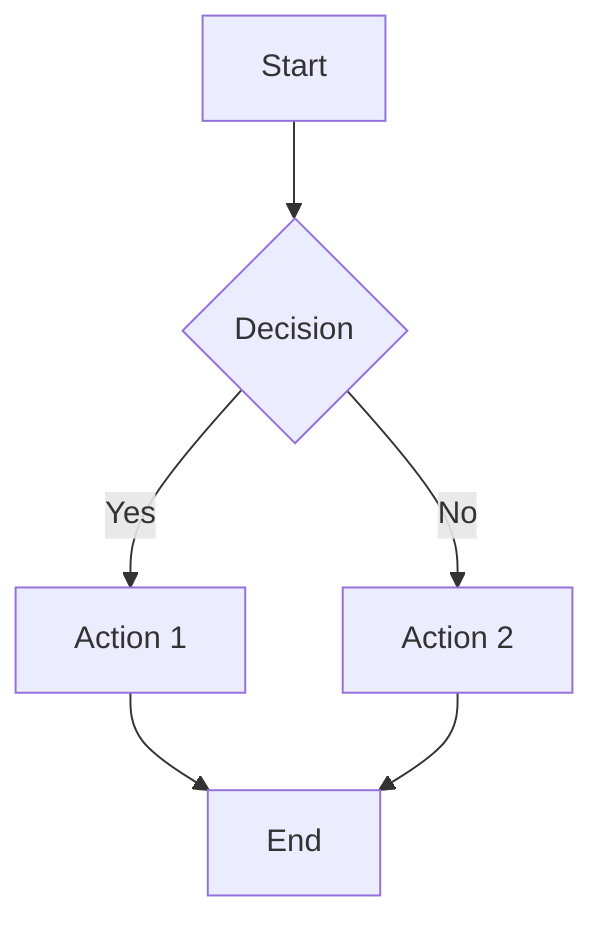

### Direction

| Keyword | Direction |
|---------|-----------|
| `TB` / `TD` | Top to bottom |
| `BT` | Bottom to top |
| `LR` | Left to right |
| `RL` | Right to left |

### Node Shapes

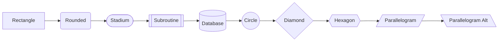

| Syntax | Shape | Use For |
|--------|-------|---------|
| `[text]` | Rectangle | Standard nodes, services |
| `(text)` | Rounded | Functions, methods |
| `([text])` | Stadium | Start/end points |
| `[[text]]` | Subroutine | External calls |
| `[(text)]` | Cylinder/Database | Data stores |
| `((text))` | Circle | Events, triggers |
| `{text}` | Diamond | Decisions |
| `{{text}}` | Hexagon | Preparation steps |

### Edge Types

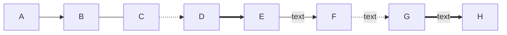

| Syntax | Type |
|--------|------|
| `-->` | Arrow |
| `---` | Line (no arrow) |
| `-.->` | Dotted arrow |
| `==>` | Thick arrow |
| `--text-->` | Arrow with label |

### Subgraphs

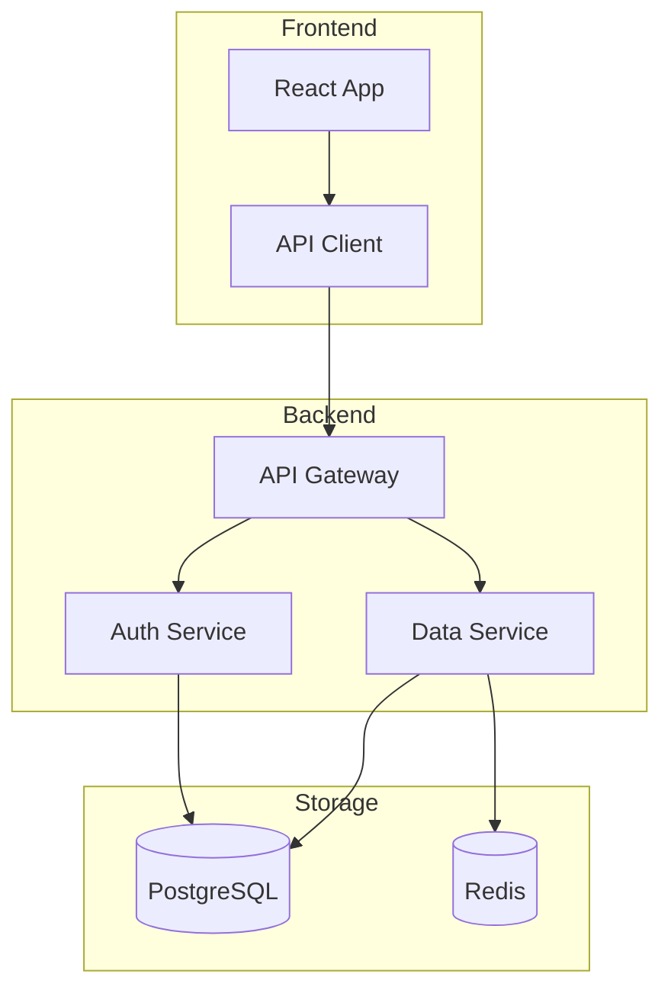

### Styling

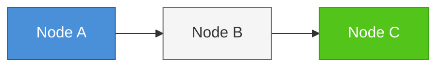

---

## Sequence Diagram

API calls, service interactions, and message flows.

### Basic Syntax

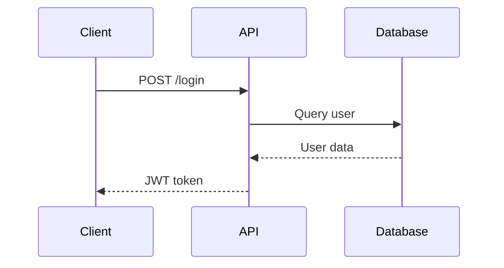

### Message Types

| Syntax | Type | Use For |
|--------|------|---------|
| `->` | Solid line | Synchronous message |
| `-->` | Dashed line | Return/response |
| `->>` | Solid arrow | Request with response expected |
| `-->>` | Dashed arrow | Response |
| `-x` | Solid cross | Async (no response) |
| `--x` | Dashed cross | Async response |
| `-)` | Solid open arrow | Async message |
| `--)` | Dashed open arrow | Async response |

### Activation

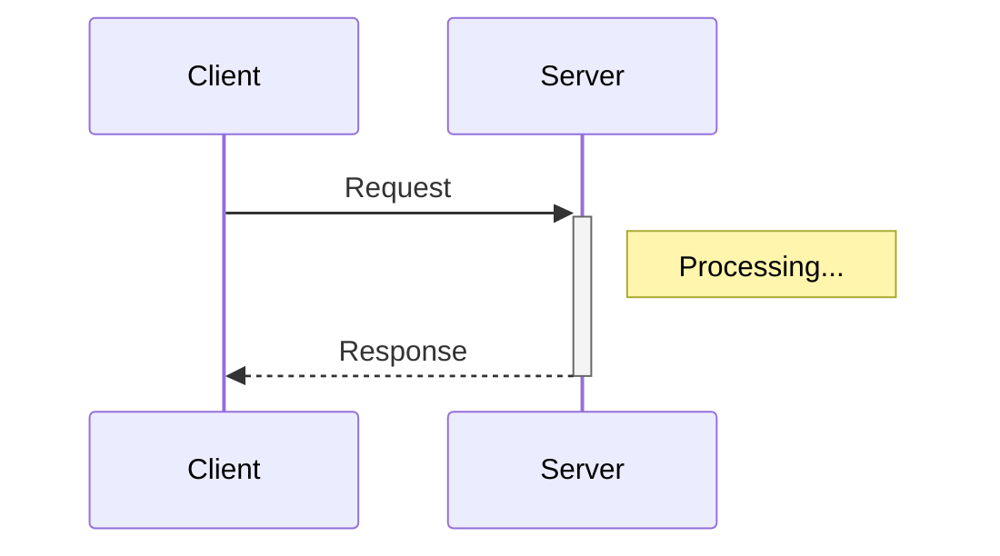

### Loops and Alternatives

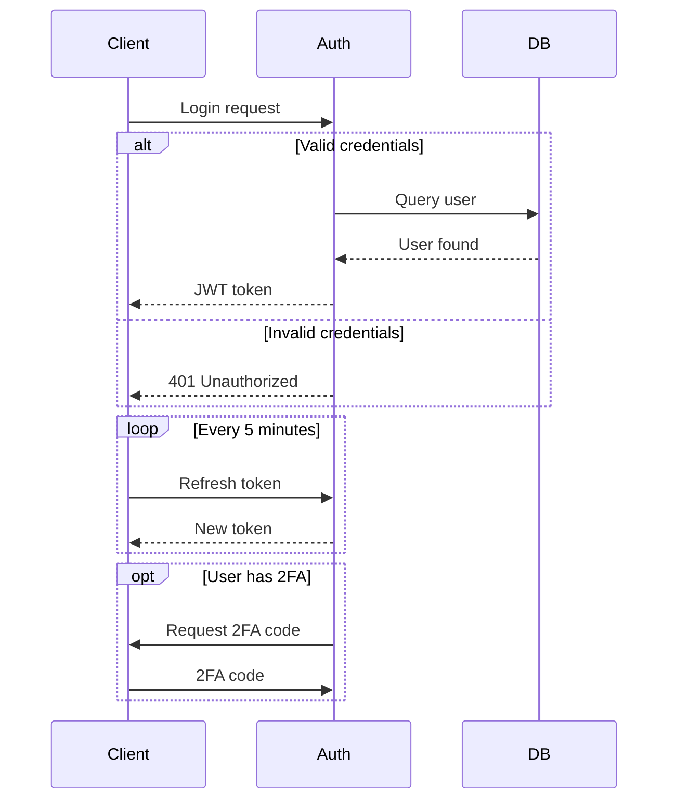

### Notes

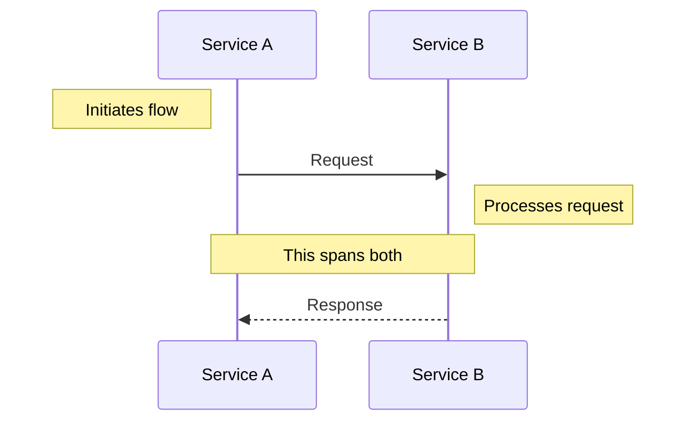

---

## Class Diagram

Object models, interfaces, and type hierarchies.

### Basic Syntax

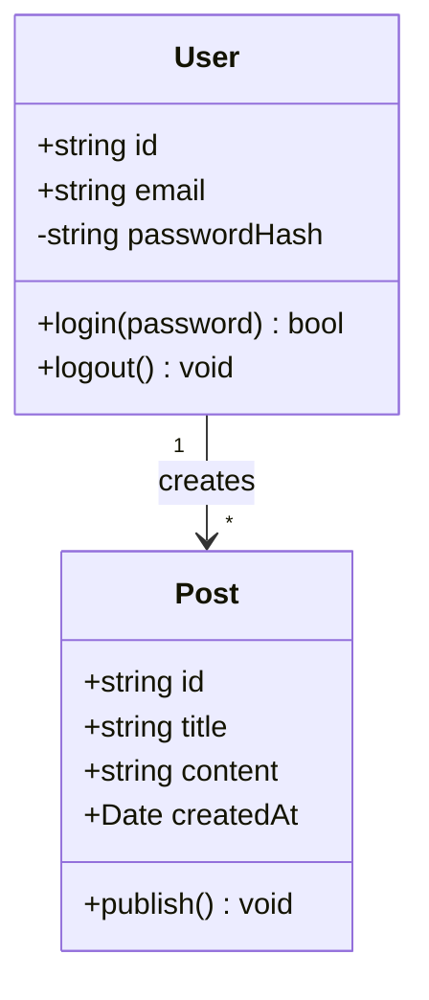

### Visibility Modifiers

| Symbol | Visibility |
|--------|------------|
| `+` | Public |
| `-` | Private |
| `#` | Protected |
| `~` | Package/Internal |

### Relationships

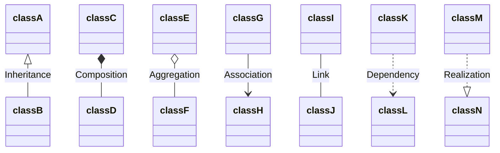

| Syntax | Relationship |
|--------|--------------|
| `<\|--` | Inheritance (extends) |
| `*--` | Composition (owns) |
| `o--` | Aggregation (has) |
| `-->` | Association |
| `..>` | Dependency |
| `..\|>` | Realization (implements) |

### Cardinality

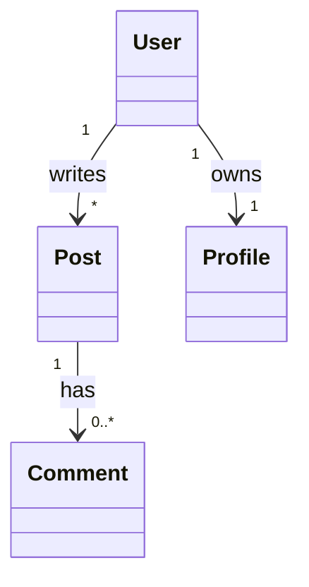

| Notation | Meaning |
|----------|---------|
| `1` | Exactly one |
| `0..1` | Zero or one |
| `*` | Many |
| `0..*` | Zero or more |
| `1..*` | One or more |
| `n..m` | Range |

### Annotations

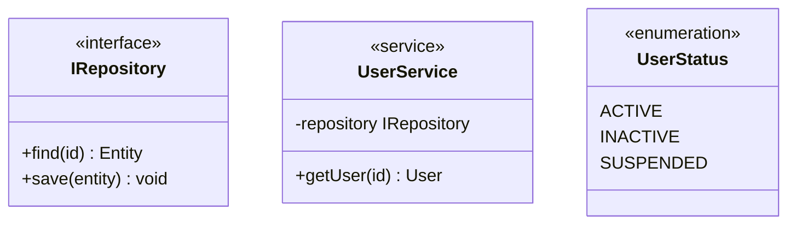

---

## State Diagram

Lifecycles, status transitions, and finite state machines.

### Basic Syntax

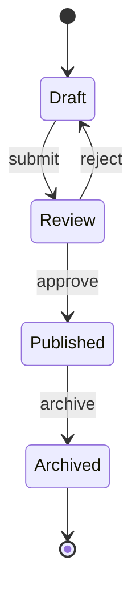

### Composite States

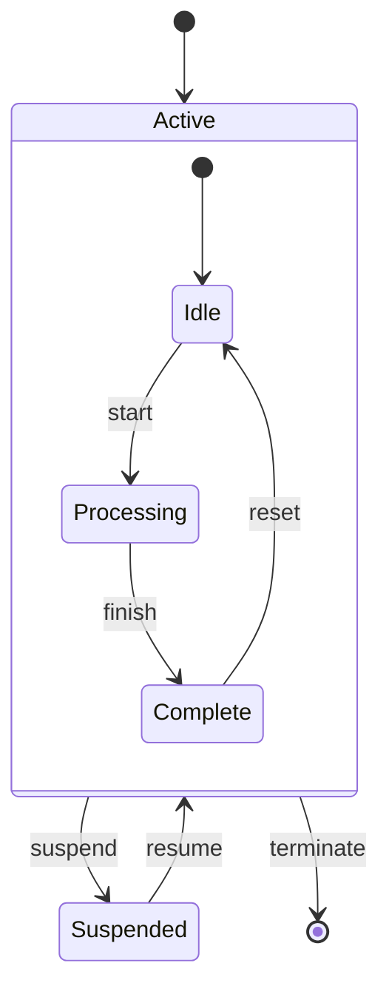

### Fork and Join

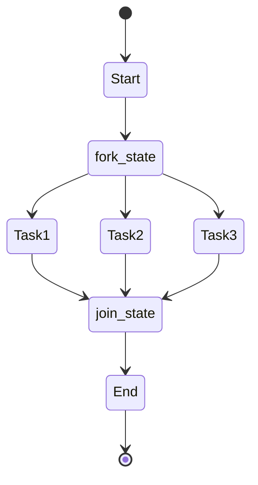

### Choice (Conditional)

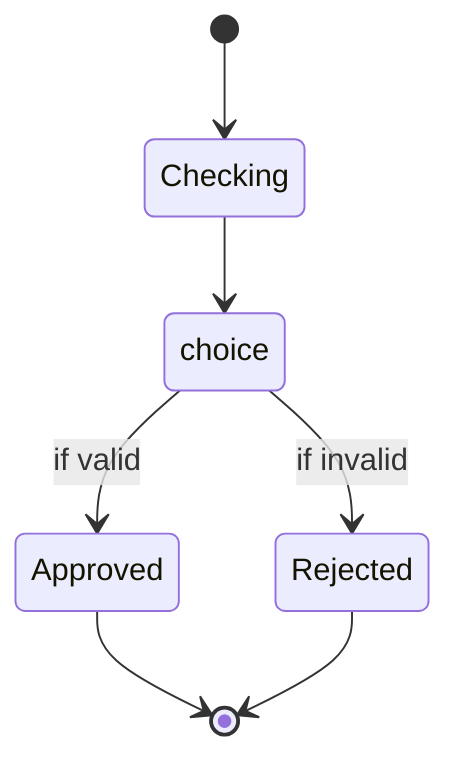

### Notes

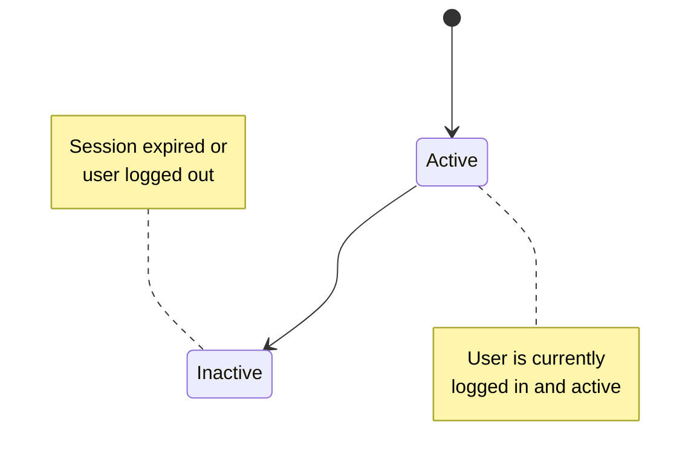

---

## Entity Relationship Diagram

Database schema and entity relationships.

### Basic Syntax

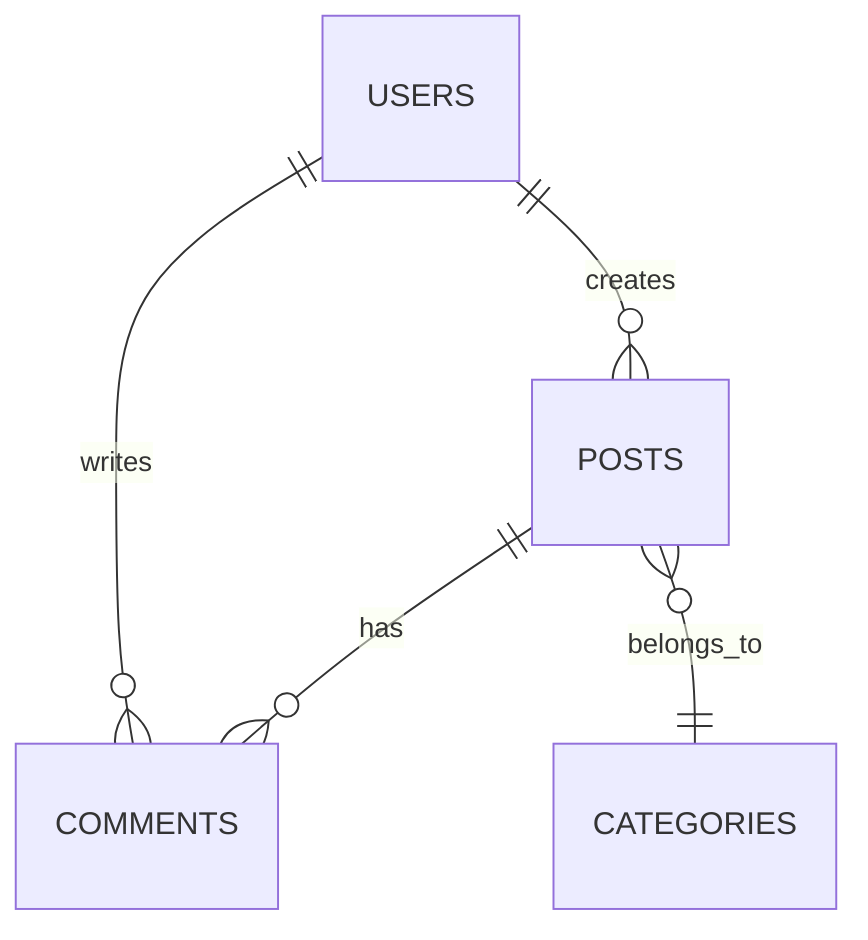

### Cardinality Notation

| Left | Right | Meaning |
|------|-------|---------|
| `\|\|` | `\|\|` | Exactly one to exactly one |
| `\|\|` | `o{` | One to zero or more |
| `\|\|` | `\|{` | One to one or more |
| `o\|` | `o{` | Zero or one to zero or more |
| `}o` | `o{` | Zero or more to zero or more |

### Relationship Types

| Syntax | Type |
|--------|------|
| `--` | Identifying (solid line) |
| `..` | Non-identifying (dashed line) |

### Attributes

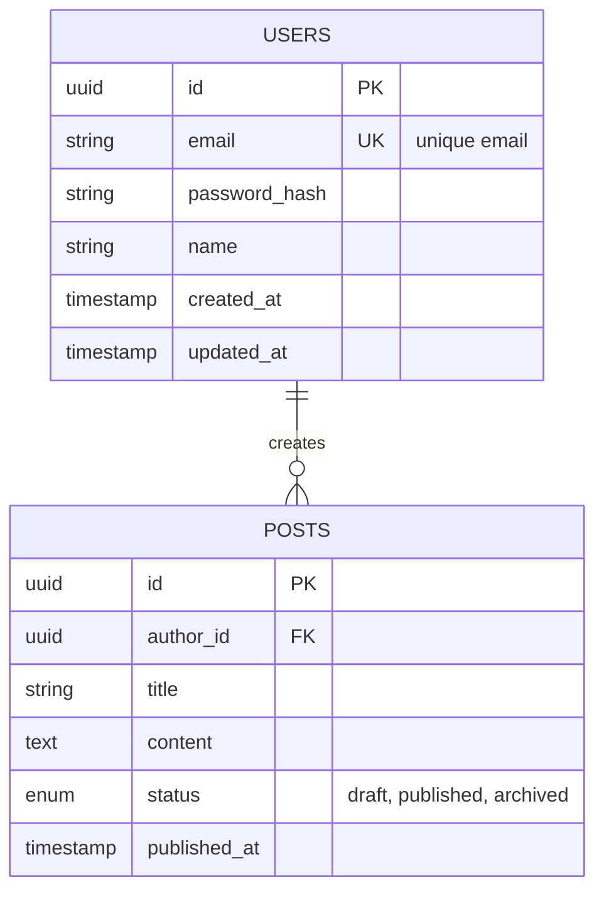

### Attribute Types

| Marker | Meaning |
|--------|---------|
| `PK` | Primary Key |
| `FK` | Foreign Key |
| `UK` | Unique Key |

---

## User Journey

User experience flows with satisfaction scores.

### Basic Syntax

```mermaid
journey
    title User Registration Journey
    section Discovery
        Visit landing page: 5: User
        Read features: 4: User
        Click signup: 5: User
    section Registration
        Fill form: 3: User
        Verify email: 2: User
        Complete profile: 4: User
    section Onboarding
        Take tour: 5: User
        Create first project: 4: User
        Invite team: 3: User
```

### Satisfaction Scores

| Score | Meaning |
|-------|---------|
| 1 | Very unhappy |
| 2 | Unhappy |
| 3 | Neutral |
| 4 | Happy |
| 5 | Very happy |

---

## Mindmap

Concept breakdown and brainstorming.

### Basic Syntax

```mermaid
mindmap
    root((Project))
        Frontend
            React
            TypeScript
            Mantine UI
        Backend
            Hono
            Drizzle ORM
            PostgreSQL
        Infrastructure
            Docker
            GitHub Actions
            Vercel
```

---

## Styling Best Practices

### Theme Selection

```mermaid
%%{init: {'theme': 'default'}}%%
graph LR
    A --> B
```

Available themes: `default`, `dark`, `forest`, `neutral`

### Custom Colors

Use semantic colors consistently:
- **Primary**: `#4a90d9` - Main components
- **Success**: `#52c41a` - Completed, valid
- **Warning**: `#faad14` - Caution, pending
- **Error**: `#f5222d` - Failed, invalid
- **Neutral**: `#666666` - Secondary elements

### Accessibility

1. Ensure sufficient color contrast (WCAG 2.1 AA)
2. Don't rely solely on color to convey meaning
3. Include text labels on all significant elements
4. Keep diagrams simple and focused

## Common Patterns

### API Flow Pattern

```mermaid
sequenceDiagram
    participant C as Client
    participant G as Gateway
    participant S as Service
    participant D as Database

    C->>G: Request
    G->>G: Validate/Auth
    G->>S: Forward
    S->>D: Query
    D-->>S: Result
    S-->>G: Response
    G-->>C: Response
```

### Microservices Pattern

```mermaid
graph TB
    subgraph External
        Client[Client App]
    end

    subgraph API Gateway
        Gateway[Kong/Nginx]
    end

    subgraph Services
        Auth[Auth Service]
        Users[User Service]
        Orders[Order Service]
    end

    subgraph Data
        AuthDB[(Auth DB)]
        UserDB[(User DB)]
        OrderDB[(Order DB)]
        Cache[(Redis)]
    end

    Client --> Gateway
    Gateway --> Auth
    Gateway --> Users
    Gateway --> Orders
    Auth --> AuthDB
    Users --> UserDB
    Users --> Cache
    Orders --> OrderDB
    Orders --> Cache
```

### CRUD State Pattern

```mermaid
stateDiagram-v2
    [*] --> Empty

    Empty --> Creating : create
    Creating --> Saved : save
    Creating --> Empty : cancel

    Saved --> Editing : edit
    Editing --> Saved : save
    Editing --> Saved : cancel

    Saved --> Deleting : delete
    Deleting --> [*] : confirm
    Deleting --> Saved : cancel
```
